# reCAP 2024 - CAP beyond day one (DevOps)

## Scenario

## BAS Access

For this workshop, there are prepared test users for you.
Each user has its own _space_ in a shared _BTP Subaccount_.
Each user is assigned the _Subaccount Viewer_ role, to be able to view the instances and subscriptions.
Also each user is entitled to use the Business Application Studio (BAS).
We recommend using BAS as development environment, as all the tools are automatically installed and up to date there.
Please note however, that the account will be deleted after the workshop, so if you want to save your project you will need to connect to your github or download it.

You can access the BTP subaccount [here](https://canary.cockpit.btp.int.sap/cockpit?idp=avpxtt84j.accounts400.ondemand.com#/globalaccount/cdd5e7c7-a590-4fe4-9baa-32008b024055/accountModel&//?section=SubaccountsSection&view=TreeTableView)

The logon credentials will be provided by the workshop hosts.

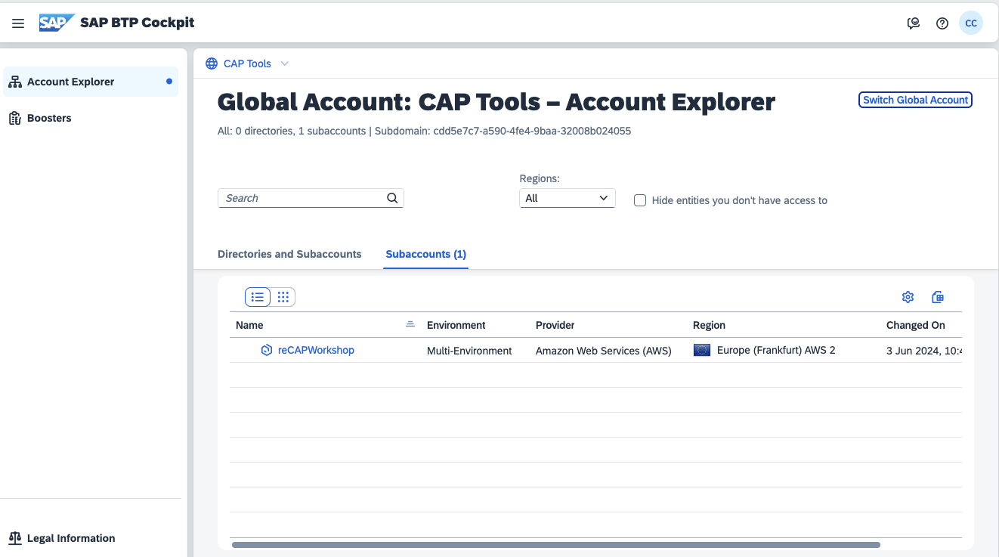

Click on `reCAPWorkshop` to open the Subaccount.

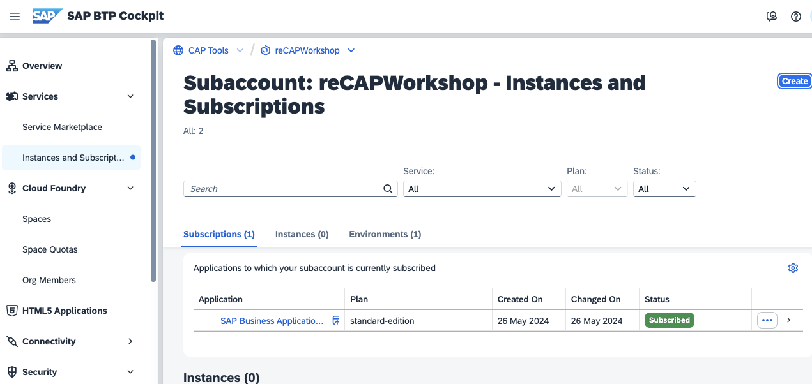

Select `Instances and Subscriptions` and click on `SAP Business Application Studio`

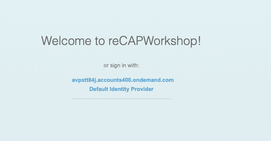

Select `avpxtt84j.accounts400.ondemand.com`

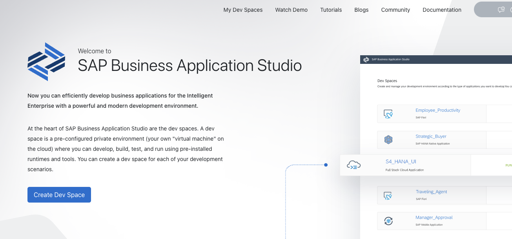

Select `Create Dev Space`

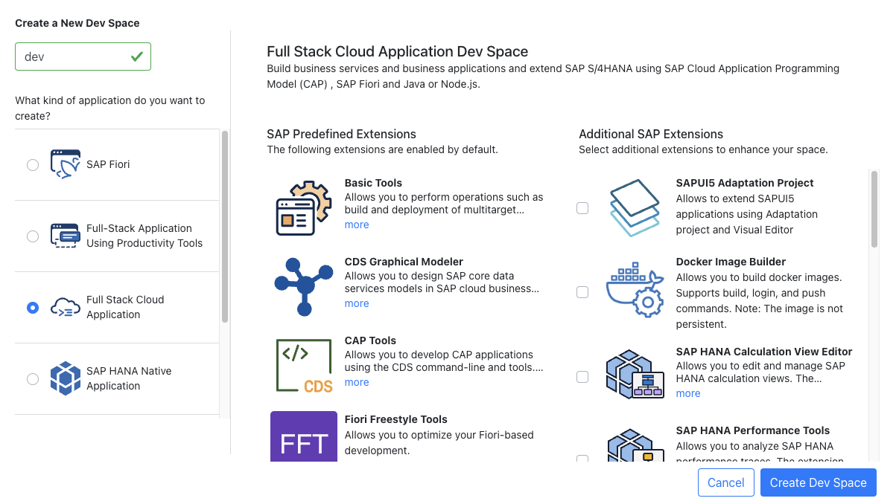

Enter a name of your choice (e.g. `dev`) in the fieldunder `Create a New Dev Space`, select the radio button for `Full Stack Cloud Application` and click on `Create Dev Space`

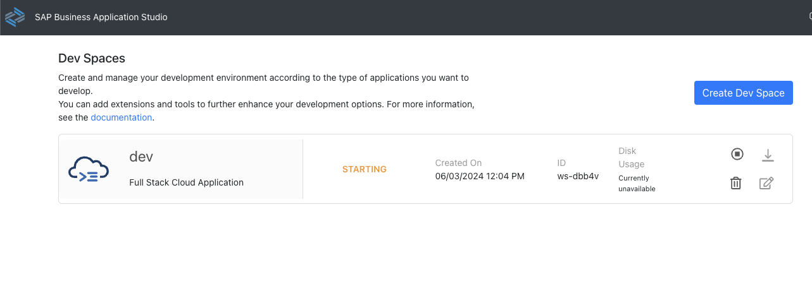

Wait until the `Dev space` is in status `RUNNING` and click on it, which will bring you here:

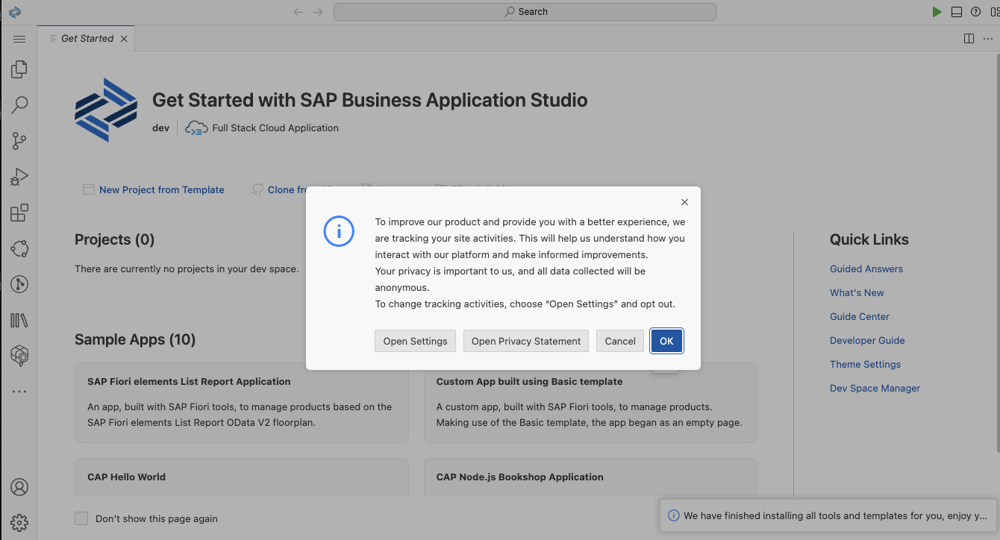

Click `OK` and choose the `Explorer View`: 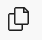 in the icon menu on the left-hand side

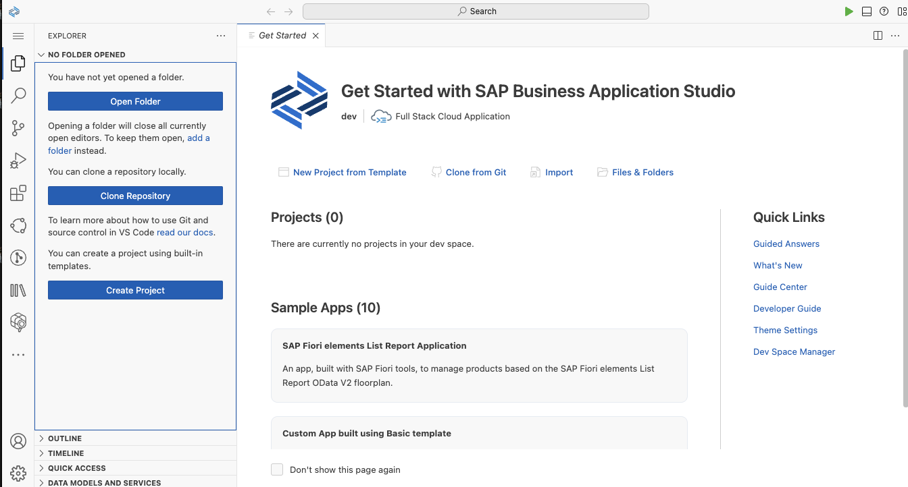

Select `Clone Repository` and enter the URL of this repository: https://github.com/recap-conf/2024_cap-beyond-day-one.git

When asked to choose a folder to clone, select `projects` under `/home/user/projects` and confirm with `OK`

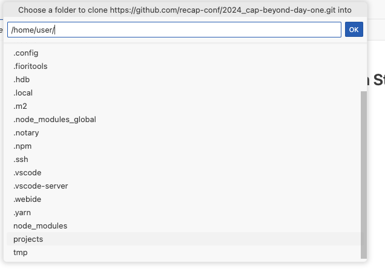

Click on `Open`

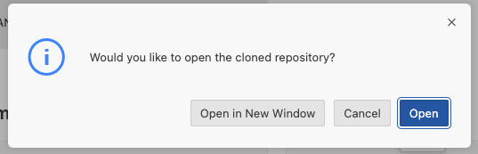

## Deployment

1. open terminal via (Hamburger) Menu &rarr; Terminal &rarr; New Terminal
1. log-in to cf via `cf l --origin avpxtt84j-platform -a https://api.cf.eu12.hana.ondemand.com`
1. build multi-target app via `mbt build`
1. deploy multi-target app `cf deploy mta_archives/bookshop-recap-ws_1.0.0.mtar`

## Logging

## Traces (OpenTelemetry)

## Dashboard

As you can see, [AdminServiceAddressHandler](https://github.com/recap-conf/2024_cap-beyond-day-one/blob/3fec65729c8693dc47c5c4784f11f961939285a5/srv/src/main/java/my/bookshop/handlers/AdminServiceAddressHandler.java#L126) defines a handler for an incoming messaging event which is responsible for the addresses replication from the remote service to the local persistence. Since in our case the remote service does not emit any events, we can use the `Developer Dashboard` to simulate the `BusinessPartnerChanged` event to test the implementation.

You can open the `Developer Dashboard` via the `Welcome Page` of the `Java Application`:

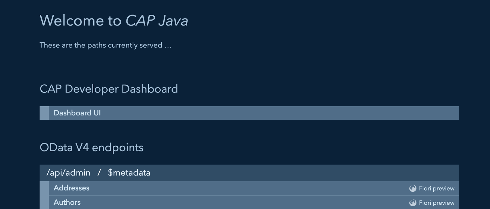

Open the `Dashboard UI` link to get in:

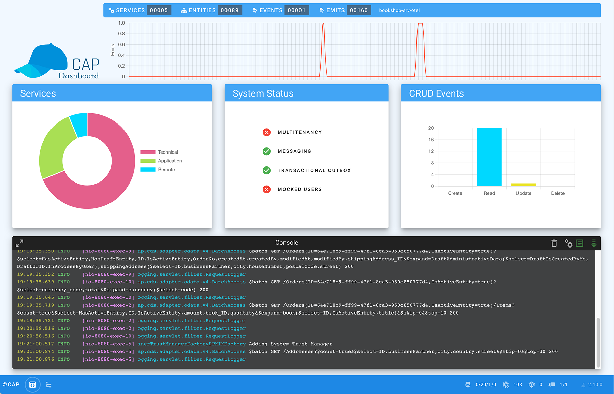

In the messaging section of the dashboard, we see the `bupa-messaging` service, which offers a subscription to our `BusinessPartnerChanged` event:

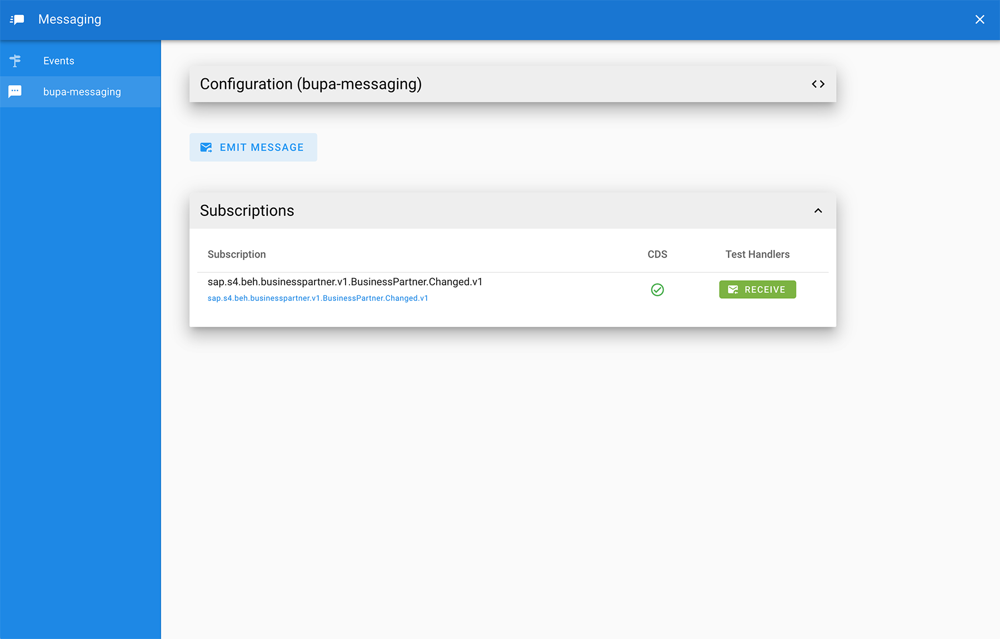

Click on the `RECEIVE` button and set the `BusinessPartner` to `10401010`:

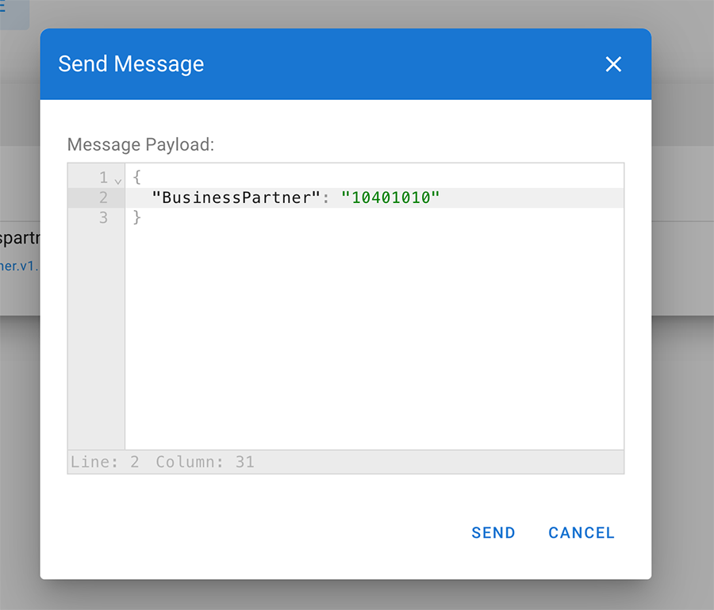

Finally confirm and you will find the logs of the custom handler in the dashboard console:

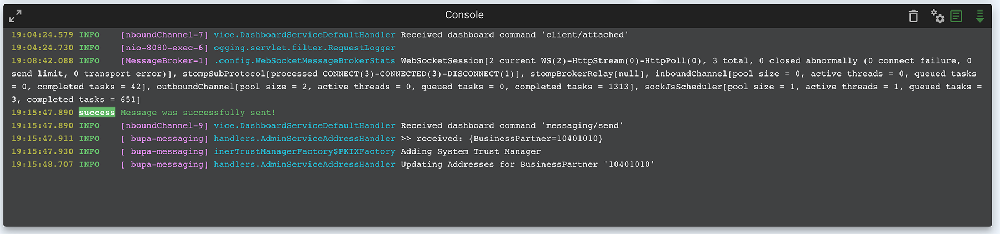

You can now check whether the data has been persisted in the persistence section of the dashboard:

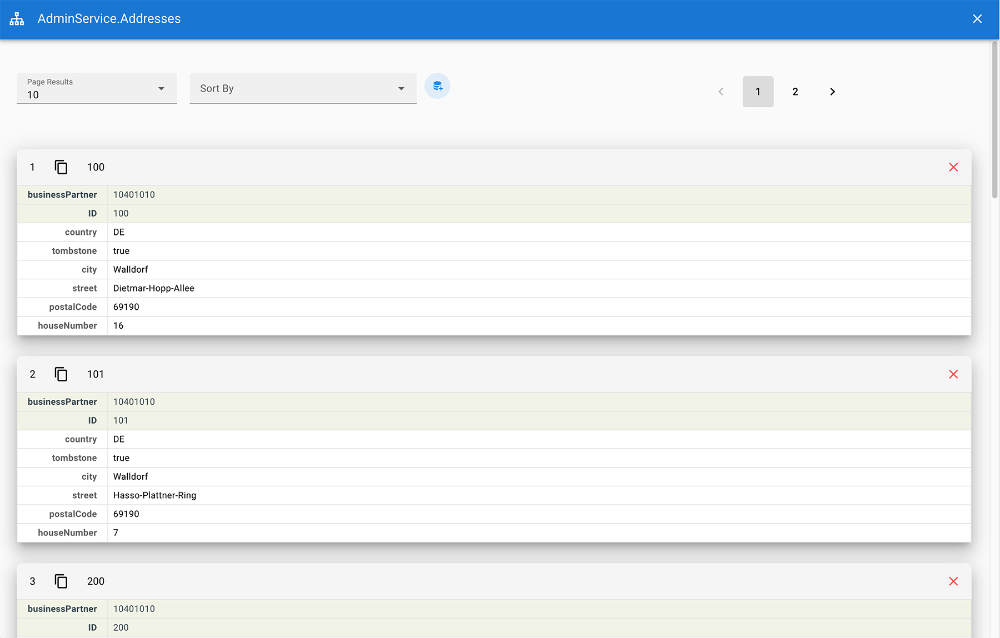
