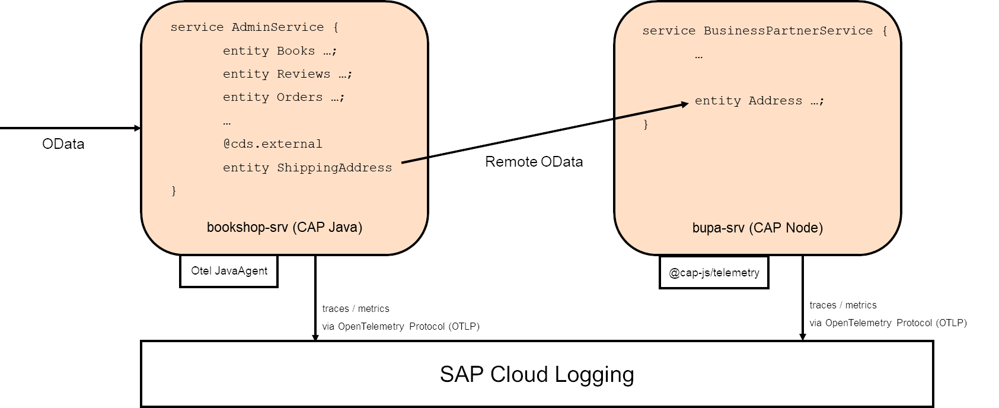

# reCAP 2024 - CAP beyond day one (DevOps)

## Scenario




## BAS Access

1. access BAS ...
1.  Clone the project:

```bash
  https://github.com/recap-conf/2024_cap-beyond-day-one.git
```


## Deployment

1. open terminal via (Hamburger) Menu &rarr; Terminal &rarr; New Terminal
1. log-in to cf via `cf l --origin avpxtt84j-platform -a https://api.cf.eu12.hana.ondemand.com`
1. build multi-target app via `mbt build`
2. deploy multi-target app `cf deploy mta_archives/bookshop-recap-ws_1.0.0.mtar`


## Logging


## Traces (OpenTelemetry)


## Dashboard
