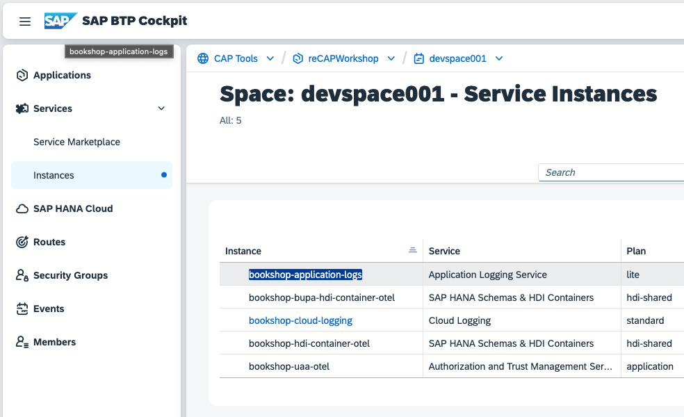
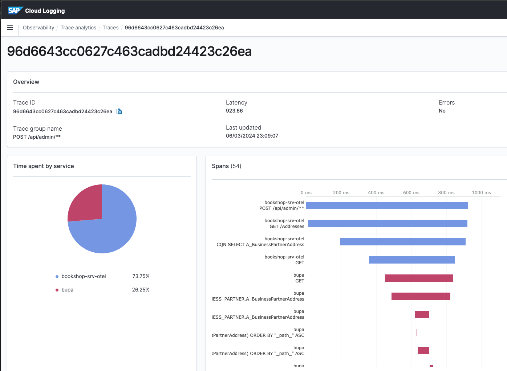

# reCAP 2024 - CAP beyond day one (DevOps)

## Scenario

The underlying scenario for this workshop is an extension project, where the extension requires master data managed by a remote system. However, we reused the bookshop sample to remain in a familiar realm. The following diagram depicts a rough overview of the scenario.

In this scenario, the `bookshop-srv` (CAP Java) is the extension and `bupa-srv` (CAP Node.js) is the remote system that governs the master data *A_BusinessPartnerAddresses*. For a single deployment step, both apps are combined into a so-called *multi-target app*.

## BAS Access

For this workshop, there are prepared test users for you.
Each user has its own _space_ in a shared _BTP Subaccount_.
Each user is assigned the _Subaccount Viewer_ role, to be able to view the instances and subscriptions.
Also each user is entitled to use the Business Application Studio (BAS).
We recommend using BAS as development environment, as all the tools are automatically installed and up to date there.
Please note however, that the account will be deleted after the workshop, so if you want to save your project you will need to connect to your github or download it.

You can access the BTP subaccount [here](https://canary.cockpit.btp.int.sap/cockpit?idp=avpxtt84j.accounts400.ondemand.com#/globalaccount/cdd5e7c7-a590-4fe4-9baa-32008b024055/accountModel&//?section=SubaccountsSection&view=TreeTableView)

The logon credentials will be provided by the workshop hosts.

Click on `reCAPWorkshop` to open the Subaccount.

Select `Instances and Subscriptions` and click on `SAP Business Application Studio`

Select `avpxtt84j.accounts400.ondemand.com`

Select `Create Dev Space`

Enter a name of your choice (e.g. `dev`) in the fieldunder `Create a New Dev Space`, select the radio button for `Full Stack Cloud Application` and click on `Create Dev Space`

Wait until the `Dev space` is in status `RUNNING` and click on it, which will bring you here:

Click `OK` and choose the `Explorer View`:  in the icon menu on the left-hand side

Select `Clone Repository` and enter the URL of this repository: https://github.com/recap-conf/2024_cap-beyond-day-one.git

When asked to choose a folder to clone, select `projects` under `/home/user/projects` and confirm with `OK`

Click on `Open`

## Deployment

More details regarding the steps you will perform next can be studied in our [Deploy to Cloud Foundry](https://cap.cloud.sap/docs/guides/deployment/to-cf) guide on cap>=ire. For the sake of time, we will reduce instructions to the minimal here.

To deploy the multi-target app, execute the following steps:

1. Open terminal via (hamburger) menu &rarr; Terminal &rarr; New Terminal
    + see screenshot below
1. Log into Cloud Foundry via `cf l --origin avpxtt84j-platform -a https://api.cf.eu12.hana.ondemand.com`
1. Build multi-target app via `mbt build`
1. Deploy multi-target app via `cf deploy mta_archives/bookshop-recap-ws_1.0.0.mtar`

As a result, you will have five apps, two of which were only needed for DB deployment and are therefore already stopped.

## Logs & Traces

Next we will look at an example of how log correlation and traces can help us identify and solve issues in apps running on BTP.

Open the launchpad (In SAP BTP Cockpit, go to your deployed app `bookshop-app-otel`, and open the application route in a new tab.) and go to app *Manage Orders*.

Press *Create*, enter an order number, select a shipping address (Again, the value help for the shipping address is populated by fetching data from the CAP Node.js app `bookshop-bupa-srv-otel`.), and press *Create*.

### Logs

Open the Application Logging Service dashboard via the service instances list in BTP Cloud Cockpit.

In the *Application Logs* section, find the log with message "Delegating GET Addresses to S/4 service", which was triggered by you opening the shipping address value help dialog. On that log entry, add a filter for the `correlation_id` (press the + button). Now you only see all requests and logs that belong to that value help request.

In the *Requests* section above, you now see the `GET` request sent from the CAP Java app to the CAP Node.js app to read the list of addresses. In that entry, there is not only a `correlation_id` but also a `trace_id`, which reflects a [W3C Trace Context](https://www.w3.org/TR/trace-context/). Copy that `trace_id`.

### Traces

Open the Cloud Logging dashboard via the service instances list in BTP Cloud Cockpit.

The necessary user and password are provided in the service binding (Single Sign-on can be configured). However, your workshop user may not access this information via BTP Cloud Cockpit, so we will get them via the [Developer Dashboard](#dashboard). Open it and press on *System Environment* in the bottom left corner.

Under *Service Bindings*, you will find the credentials.

Use `dashboards-username` and `dashboards-password` to log in.

If necessary, confirm the selection of tenant `Global`.

In Cloud Logging, navigate to *Observability* &rarr; *Traces*.

Enter the copied `trace_id` into the search bar and select the respective entry. What you see is a so-called *distributed trace*, as it spans across multiple applications.

Do you see anything peculiar?

> Hint: Check the [custom handler](./bupa/srv/bupa.js) of the `API_BUSINESS_PARTNER` service of the CAP Node.js app.

## Dashboard

As you can see, [AdminServiceAddressHandler](https://github.com/recap-conf/2024_cap-beyond-day-one/blob/3fec65729c8693dc47c5c4784f11f961939285a5/srv/src/main/java/my/bookshop/handlers/AdminServiceAddressHandler.java#L126) defines a handler for an incoming messaging event which is responsible for the addresses replication from the remote service to the local persistence. Since in our case the remote service does not emit any events, we can use the `Developer Dashboard` to simulate the `BusinessPartnerChanged` event to test the implementation.

You can open the `Developer Dashboard` via the `Welcome Page` of the `Java Application`:

Open the `Dashboard UI` link to get in:

In the messaging section of the dashboard, we see the `bupa-messaging` service, which offers a subscription to our `BusinessPartnerChanged` event:

Click on the `RECEIVE` button and set the `BusinessPartner` to `10401010`:

Finally confirm and you will find the logs of the custom handler in the dashboard console:

You can now check whether the data has been persisted in the persistence section of the dashboard:

In some cases, we want to see if the outbox is configured correctly and the events in the outbox are processed asynchronously. Since the audit log events are processed by the outbox, we can trigger them by fetching the books list in the `Browse books` action of the application:

In the outbox section, you will find in the outbox history the audit log event that was processed by the outbox. You can repeat it or create a new custom outbox event to see how it behaves:

