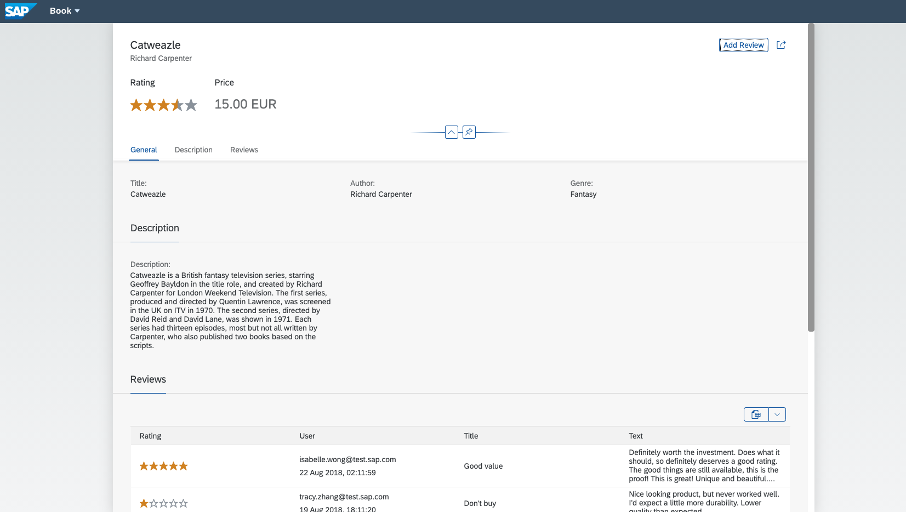

<!-- omit in toc -->
# Welcome to CAP Samples for Java


[](https://api.reuse.software/info/github.com/SAP-samples/cloud-cap-samples-java)

Welcome to the bookshop-java project. It demonstrates how to build business applications using the [CAP Java SDK](https://cap.cloud.sap) providing a book shop web application as an example. The application in this project enables browsing books, managing books, and managing orders.



<!-- omit in toc -->


# Getting Started

The following sections describe how to set up, build, and run the project.

## Prerequisites

Make sure you have set up a development environment (that means, you’ve installed the CDS Compiler, Java, and Apache Maven) [as described here](https://cap.cloud.sap/docs/java/getting-started).

## Clone Build & Run

1.  Clone the project:

```bash
  https://github.com/recap-conf/2024_cap-beyond-day-one.git
```

2. Build and run the application:

```
  mvn spring-boot:run
```


### Building and Running

1.  To **compile** the project, right-click the file `pom.xml` in the `bookshop-parent` project root folder and select
**Run as** > **Maven build**.

    In the following dialog, enter the string `clean install` into the field labeled with "Goals" and click "Run".

    Note: This step also compiles the CDS artifacts, thus repeat this once you made changes to the CDS model. This step also generates source files, therefore refresh the "bookshop" project in your IDE.

2.  To **run** the application, right-click the `bookshop` project root in the Package Explorer and select **Run as** > **Spring Boot App** (make sure you have [Spring Tools 4 installed](https://marketplace.eclipse.org/content/spring-tools-4-aka-spring-tool-suite-4)).

    This step creates a default Run Configuration named `Bookshop - Application` and starts the application afterwards. To go on with the next step, stop the application again.

3.  Then, set the default working directory by editing your Run Configuration via **Run** > **Run Configurations** > **Bookshop - Application**. On the tab **Arguments** change the default **Working Directory** to:

	```${workspace_loc:bookshop-parent}```

	Afterwards, click **Run**. This step starts the applications `main` method located in `src/main/java/my/bookshop/Application.java`.

4.  Use the following links in the browser to check if everything works fine:

    <http://localhost:8080/>: This should show the automatically generated index page of served paths.
    <http://localhost:8080/fiori.html>: This is the actual bookshop application UI.
    <http://localhost:8080/swagger/index.html>: This is providing a Swagger UI for the CatalogService API.

    You'll start with a predefined stock of books as this procedure starts the bookshop application with a CSV-initialized in-memory H2 database.

    Two mock users are defined for local development:
    - User: `user`, password: `user` to browse books
    - User: `admin`, password: `admin` to manage books and orders


## Deploy to SAP Business Technology Platform, Cloud Foundry

Prerequisites:
- Install the [Cloud MTA Build Tool](https://sap.github.io/cloud-mta-build-tool/): `npm install -g mbt`.
- Install the [Cloud Foundry Command Line Interface](https://docs.cloudfoundry.org/cf-cli/install-go-cli.html).
- Get an SAP Business Technology Platform account to deploy the services and applications.
- [Create a SAP HANA Cloud Instance](https://developers.sap.com/tutorials/hana-cloud-deploying.html) in your SAP Business Technology Platform space.
- Ensure you have an entitlement for `SAP HANA Schemas & HDI Containers` with plan `hdi-shared` in the same space.
- Ensure that your CF instances are connected to Internet to download SAPMachine JRE 17 as it is available in `sap_java_buildpack` in online mode only.

Deploy as Single Tenant Application:
- Run `mbt build`
- Run `cf login`
- Run `cf deploy mta_archives/bookshop-recap-ws_1.0.0.mtar`


# Get Support

In case you have a question, find a bug, or otherwise need support, please use our [community](https://answers.sap.com/tags/9f13aee1-834c-4105-8e43-ee442775e5ce). See the documentation at [https://cap.cloud.sap](https://cap.cloud.sap) for more details about CAP.

# License

Copyright (c) 2022 SAP SE or an SAP affiliate company. All rights reserved. This file is licensed under the Apache Software License, version 2.0 except as noted otherwise in the [LICENSE](LICENSES/Apache-2.0.txt) file.
